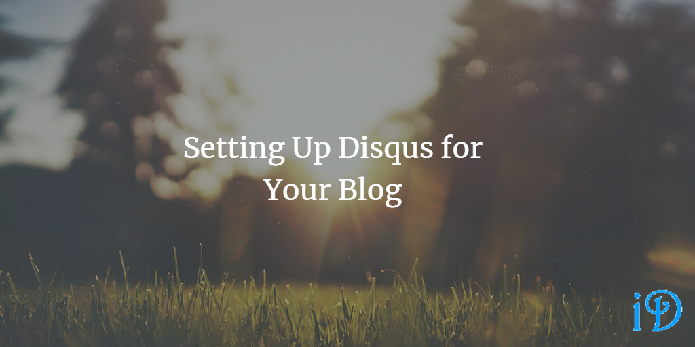

I just added a comments section to this blog using Disqus! Here's how.

Scroll down to the bottom of this page, and you'll see a brand-new comments section!

This comments section is powered by Disqus and allows (as you might expect) commenting on my blog posts. But how, you ask, did I get this set up? And how can you set it up on your own blog?

How I Set Up Disqus
--

There are two main steps to setting up Disqus. The first is to go to disqus.com, set up an account, and connect your website. Disqus has a number of paid plans that you can select from, but the free Basic plan is plenty for a basic blog. The process here is more or less self-evident in Disqus's UI. Once I reached the install step, I did something a little different.

Instead of using Universal Code (since I'm not using a site like Wix), I used a friend's [blog](https://ardalis.com/blog) and [GitHub repo](https://github.com/ardalis/ardalis-com-gatsby) as an example to add the Disqus plugin for my blog. I searched the entire repository for "disqus" and added all code with that mention to my blog.

After that, with a little troubleshooting (your shortname, for example, **must** match the shortname Disqus lists under General on your admin page for the site you're trying to configure), I had Disqus up and running on my blog. It was surprisingly quick and painless!

Resources for You
--

If you are using Gatsby for your site (and especially if you are using the same template as me (Gatsby + Netlify CMS Starter)), take a look at [my GitHub repo](https://github.com/ilyanaDev/ilyanaDevBlog).

Disqus also has some very helpful tutorials embedded in their website as you work through the process of setting up your site.

Other Helpful Tips
--

- If you'd like to receive email notifications from Disqus when someone comments on your blog, you need to configure that from your profile menu, rather than from the site's admin page. Navigate to your profile page, click **Notifications** at the top, then click **Settings** to the left. From here, you can click the link labeled *Go to Email Notifications.* From there, you can configure your email notifications.
- I'd definitely say an incorrect shortname is probably the most likely thing tripping you up if your Disqus comments section is not loading, so triple-check that if you're having issues.
- Luckily, if you have something wrong with Disqus setup when you commit your site, it isn't a big deal, because you should just get a message at the bottom of each of your blog posts reading "We were unable to load Disqus," rather than crashing your whole site.

Thanks for reading! I hope you find this and other articles here at ilyanaDev helpful! Be sure to follow me on Twitter [@ilyanaDev](https://twitter.com/ilyanaDev).
