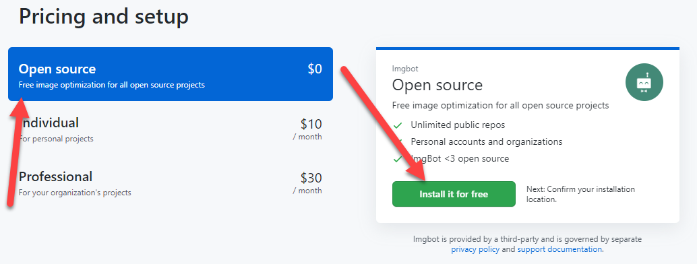
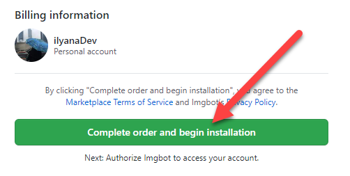
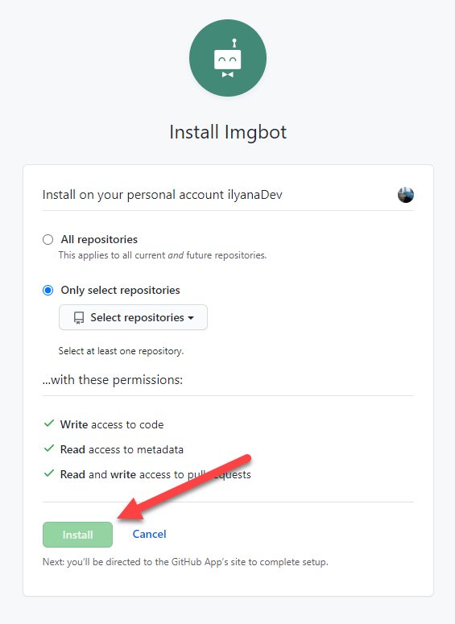
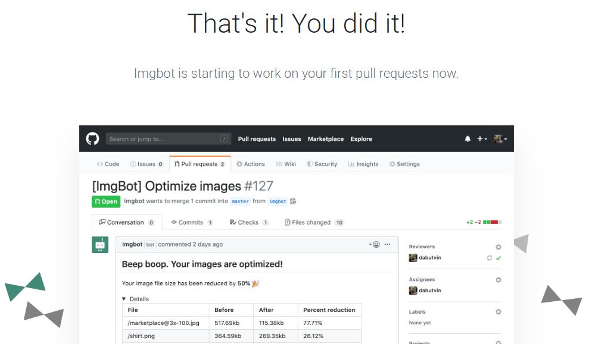

Imgbot optimizes images in your GitHub repository for better performance.

Imgbot can be added to any GitHub repository and essentially compresses the images in that repository as needed to increase performance. Each image compression (or set of image compressions) is submitted as a pull request, so you still have control of how your files are altered. This is especially helpful in repositories running websites (like the [repository](https://github.com/ilyanaDev/ilyanaDevBlog) for this blog!).

Installing Imgbot
--

To get set up Imgbot, go to the [Imgbot page](https://github.com/marketplace/imgbot) on the GitHub marketplace. From here, you can click **Set up a plan**.

Select the "Open source" plan (assuming you'll be using it for an open source project). Next click **Install it for free**.

On the next page, click **Complete order and begin installation**.

Finally, decide which of your repositories you'd like to apply Imgbot to and then click **Install**. 

On the next page, you'll authorize Imgbot to access your GitHub, and you're all done. Wait for Imgbot to send you a pull request to optimize your images.

Thanks for reading! I hope you find this and other articles here at ilyanaDev helpful! Be sure to follow me on Twitter [@ilyanaDev](https://twitter.com/ilyanaDev).
