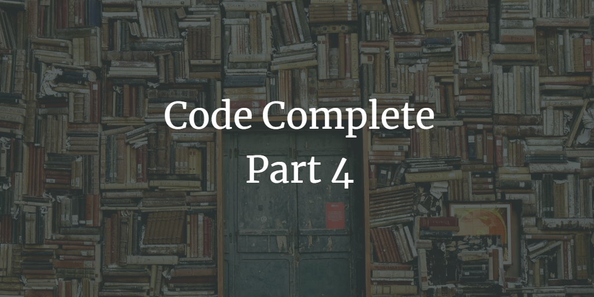

Code Complete by Steve McConnell is a well-written explanation of themes in software construction.

I'm working my way through the second edition of *Code Complete* by Steve McConnell. Here are my notes from **Part 4: Statements**.

Part 4 includes chapters 14-19: Organizing Straight-Line Code, Using Conditionals, Controlling Loops, Unusual Control Structures, Table-Driven Methods, and General Control Issues.

14\. Organizing Straight-Line Code
--

* Dependencies mean that one line of code depends on another having already been executed. Therefore, dependencies lead to sequences being executed in a set order. When building code with dependencies, make them very clear.
  * Organize code so that dependencies are obvious
  * Name routines so that dependencies are obvious
  * Use routine parameters to make dependencies obvious
  * Document unclear dependencies with comments
  * Check for dependencies with assertions or error-handling code
* When working with statements whose order doesn't matter:
  * **Keep related actions together**
  * For readability, make code read and flow from top to bottom

15\. Using Conditionals
--

* `if` statements
  * Guidelines for working with simple if-then statements:
    * Write the nominal path through the code first, then write the unusual cases
    * Make sure that you branch correctly on equality: `<` vs. `<=`
    * Put the normal case after the if rather than after the else
    * Follow the if clause with a meaningful statement
    * Consider the else clause
    * Test the else clause for correctness
    * Check for reversal of the if and else clauses
  * Guidelines for working with chains of if-then-else statements:
    * Simplify complicated tests with boolean function calls
    * Put the most common cases first
    * Make sure that all cases are covered
    * Replace if-then-else chains with other constructs if your language supports them - case statements, for example
* `case` or `switch` statements
  * vary quite a bit between languages
  * ways to order case statements:
    * numerically
    * alphabetically
    * put the normal case first
    * by frequency
  * how to use case statements:
    * keep the actions of each case simple - write a separate routine if needed
    * don't make up phony variables to be able to use the case statement
      * in other words, just map the data onto the case statement or use if-then-else chains if data is too complicated for that
    * use the default clause only to detect legitimate defaults
    * use the default clause to detect errors
    * in C++ and Java be sure to use `break` to avoid dropping through the end of a case statement
    * in C++, clearly identify flow-throughs at the end of each case

16\. Controlling Loops
--

* `while`, `do-while`, etc.
  * use when you don't know exactly how many times you'll want the loop to iterate
  * `while` tests condition at beginning, `do-while` tests condition at end
* Loop-with-exit loop
  * when you test a condition in the middle of the loop with a `break`, `goto`, or other statement
  * use when you'd need to code a loop-and-a-half to achieve the desired result
  * put all the exit conditions in one place (put this kind of loop in `while(true)`, for example)
  * use comments for clarification
* `for` loops
  * use for loops that should be executed a certain, known number of times
  * use it for simpler uses; `while` loops should be used in more complex applications
* `foreach` loops
  * when an operation must be performed on each member of an array or other container
* Entering loops
  * enter the loop from one location only
  * put initialization code directly before the loop
  * use `while(true)` for infinite loops
  * prefer `for` loops when appropriate
  * conversely, don't use a `for` loop if a `while` loop is more appropriate
* Processing the middle of a loop
  * use curly braces to enclose the statements in a loop
  * avoid empty loops
  * keep loop-housekeeping chores either at the beginning or at the end of the loop
  * make each loop perform only one function
* Exiting a loop
  * assure yourself that the loop ends
  * make loop-termination conditions obvious
  * don't monkey with the loop index of a `for` loop to make the loop terminate
    * use a `while` loop instead if the above seems necessary
  * avoid code that depends on the loop index's final value
  * consider using safety counters - variables incremented each pass through the loop to determine if the loop has been executed too many times
  * exiting loops early:
    * use `break` to exit the loop and resume program at first line following the loop
    * use `continue` to skip to the next iteration of a loop
    * consider using `break` statements instead of boolean flags in a `while` loop
    * be wary of a loop with a lot of `break` statements strewn through it
    * use `continue` for tests at the top of a loop
      * instead of using `continue` towards the middle or end of a loop, use an `if` statement
    * use the labeled `break` structure if your language supports it
    * use `break` and `continue` only with caution
* Checking endpoints
  * mentally run through the whole loop to check for off-by-one errors
  * use a calculator to double-check any complex calculations
* Using loop variables
  * use ordinal or enumerated types for limits on both arrays and loops - loop counters should be integers
  * use meaningful variable names to make nested loops more readable
  * use meaningful variable names to avoid loop-index cross-talk
  * limit the scope of loop-index variables to the loop itself
    * how this works can vary between languages and between compilers
* How long should a loop be?
  * short enough to view all at once
  * limit nesting to three levels
  * move loop innards of long loops into routines
  * make long loops especially clear
* To create a complex loop, it's sometimes best to work from the inside-out:
  * first, code one case with literals
  * second, put that case inside a loop and replace the literals with loop indexes or computed expressions
  * put another loop around that and repeat as necessary
  * add all necessary initializations

17\. Unusual Control Structures
--

* Multiple returns from a routine
  * the `return` statement in C++ or Java allows a routine to terminate partway through
  * use a `return` to enhance readability
  * use guard clauses (early returns or exits) to simplify complex error processing
  * minimize the number of returns in each routine
* Recursion
  * when a routine calls itself
  * used when a small part of a problem is easy to solve, and the larger problem is easy to decompose into these smaller pieces
  * very elegant when used properly
    * good for sorting, for example
  * very complicated when used inappropriately
  * make sure the recursion stops
  * use safety counters to prevent infinite recursion
  * limit recursion to one routine
  * keep an eye on the stack
  * don't use recursion for factorials or Fibonacci numbers
    * these are often used for explaining recursion in textbooks but not very efficient in real life
* `goto`
  * Argument against `goto`s:
    * they're confusing and mess with the logical structure of your code
    * they mess up compiler optimizations
    * they often lead to slower, larger code
    * McConnell concludes that there is really no reason to use them, and you should just leave them out of your code
  * Argument for `goto`s:
    * when used very, very carefully, they might be ok
    * they can eliminate the need for duplicate code
    * useful for when you want to allocate resources, perform operations on them, and then deallocate them
    * they can sometimes make code faster and smaller
    * "the most carefully engineered programming language in history," Ada, chose to include `goto`s
  * `goto`s should be used only when other options have been carefully considered
  * Error processing
    * error processing involves testing for errors every step of the way and then deallocating resources at the end. `goto`s can clean this up nicely, but alternatives include:
      * nested `if` statements
      * status variables
      * `try-finally`
    * whichever alternative you pick, be consistent throughout the project
  * Sharing code in an `else` clause
    * some programmers use a `goto` when they have two conditional tests and an else clause and they want to execute code in one condition and the else clause
    * the alternative is to write a routine for the code the `goto` would have pointed to
  * you can almost always eliminate the `goto` with a simple, more readable solution
    * when you legitimately cannot, make sure your `goto` is well-documented
  
18\. Table-Driven Methods
--

* Table-driven method = scheme that allows you to look up information in a table, rather than using logic statements
* Table-driven code (when used correctly) has several advantages to logic statements: it's simpler, easier to modify, and more efficient
* Table-driven code is about putting your program's knowledge into its data (an array, for example) rather than its logic
* Issues that need addressed when using table-driven methods:
  * how to look up entries in the table? Direct access? Indexed access? Stair-step access?
  * what to store in the table? Data? Reference to an action? Code describing an action?
* With direct access you can pick out the entry you need directly
* data is generally more flexible than logic
* Fudging table-lookup keys - for when data isn't well-behaved
  * duplicate information to make the key work directly
  * transform the key to make it work directly
  * isolate the key transformation in its own routine
    * use ready-made key transformation if your environment provides them
* Indexes use primary data to look up a key in an index table, then use that value to look up the data you're interested in
  * if each entry in the main lookup table is large, there is less wasted space in creating an index array with empty entries than a main table with empty entries
  * it's sometimes easier to manipulate entries in an index rather than entries in a main table
  * data encoded in tables is easier to maintain than data encoded in code
* Stair-step access tables are less direct than indexes, but they waste less space
  * essentially, entries in a tale are valid for ranges of data, rather than distinct datapoints
  * works well with irregular data
  * flexible and modifiable, like other table-driven approaches
  * guidelines for working with stair-step:
    * watch the endpoints
    * consider using a binary search rather than a sequential search
    * consider using indexed access instead of the stair-step technique
    * put the stair-step table lookup into its own routine

19\. General Control Issues
--

* Boolean expressions
  * compare boolean values to true and false implicitly - `while(a>b)` rather than `while( (a>b) ) = true)`
  * break complicated tests into partial tests with new boolean variables
  * move complicated expressions into boolean functions for readability and abstraction
  * use decision tables instead of complicated conditions
  * avoid using lots of negatives
    * in `if` statements, be sure that there is a positive condition for the `if` clause
    * apply DeMorgan's Theorems to simplify boolean tests with negatives:
      * not A and not B = not (A or B)
      * not A and B = not (A or not B)
      * A and not B = not (not A or B)
      * A and B = not (not A or not B)
      * not A or not B = not (A and B)
      * not A or B = not (A and not B)
      * A or not B = not(not A and B)
      * A or B = not(not A and not B)
  * **use parentheses** for clarity
    * balance parentheses by counting up for "(" and down for ")"
  * understand how boolean expressions are evaluated in your language
  * when comparing numbers, arrange them left to right as you'd expect to see them on a number line
  * when comparing to zero:
    * compare logical variables implicitly
    * compare numbers explicitly to 0
    * in C, compare characters to the null terminator explicitly
    * compare pointers to NULL
  * in C-derived languages, put constants on the left side of expressions
  * in C++, consider preprocessor substitutions for `&&` `||` etc.
  * in Java, understand the difference between `a==b` and `a.equals(b)`
* Compound statements (aka Blocks)
  * block = collection of statements treated as a single statement for purposes of controlling a program's flow
  * compound statements have curly braces around them
  * when working with compound statements:
    * write pairs of braces together in order ot ensure your pairs of braces are always correctly matched
    * use braces to clarify conditionals (`if`, `while`, etc.)
      * don't just write your single statement on one line with no braces; this is an error-prone approach and a big hurdle to readability
* Null statements
  * just a semicolon in C++
  * avoid these as much as possible, and make them super obvious when you can't avoid them
  * you can also create a preprocessor `DoNothing()` to make it super clear nothing is supposed to be done
    * like "This page intentionally left blank"
  * can you write the code in a different way that is more clear and does not require a null statement?
* Deep nesting
  * research suggests people find it very difficult to understand more than three levels of nested `if` statements
  * how to reduce nesting depth:
    * retest part of the condition in a new statement rather than continuing to nest
    * use a `break` block to simplify - only use if your whole team is familiar with this approach, as it's fairly rare
    * sometimes you can replace nested `if` statements with if-then-else statements, which greatly increases readability
    * convert a nested `if` to a `case` statement
    * factor deeply nested code into its own routine.
    * use an object-oriented approach
    * redesign your deeply nested code
* Structured programming
  * introduced in 1969; many of its concepts are still useful today
  * the idea is that a program should use only one-in, one-out control constructs; it cannot jump around, but can be read top-to-bottom and is executed top-to-bottom too
  * 3 Components:
    * Sequence - a set of statements executed in order
    * Selection - statements are executed selectively via if-then-else or case statements
    * Iteration - a group of statements are executed multiple times; a "loop"
  * the idea is that you can create any control flow whatsoever from these three components
* How control structures are used has important correlation to complexity of a program
* To measure complexity, you can count the number of decision points in your routine - 1 for the direct path, then another decision point for each of the following: if, while, repeat, for, and, or
  * with more than 6, you should simplify
  * with more than 10, you should split up the routine into multiple routines
  * McCabe's complexity metric is the most commonly used and discussed

Thanks for reading! I hope you find this and other articles here at ilyanaDev helpful! Be sure to follow me on Twitter [@ilyanaDev](https://twitter.com/ilyanaDev).
