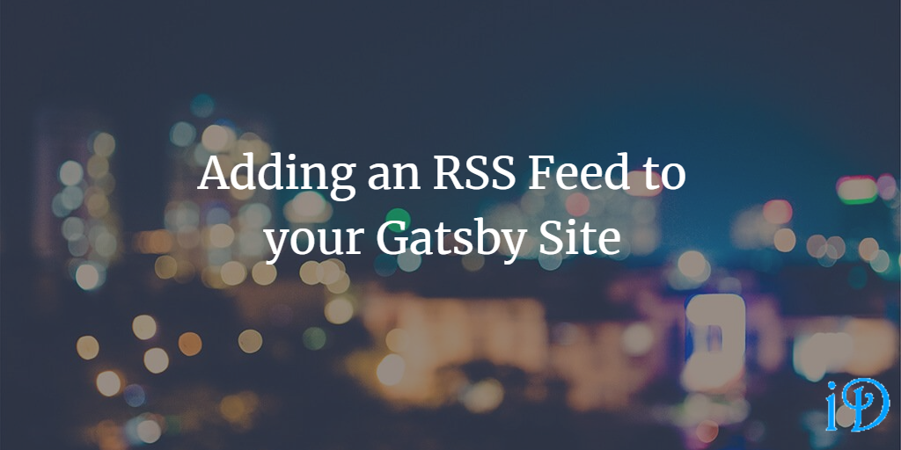

An RSS (really simple syndication) feed allows users using an RSS reader to subscribe to content and be notified when new content is added to a site.

If you use an RSS Reader...
--

You can add my blog by pasting the following URL into your reader: [https://ilyana.dev/rss.xml](https://ilyana.dev/rss.xml)

If you're interested in adding an RSS feed to your Gatsby site...
--

Gatsby provides a [tutorial](https://www.gatsbyjs.org/docs/adding-an-rss-feed/) for using this plugin, which explains the requisite commandline prompts, as well as the changes you'll need to make to your code.

If you're using the same template as me (the [gatsby starter netlify cms](https://www.gatsbyjs.org/starters/netlify-templates/gatsby-starter-netlify-cms/) template), you may find it useful to view the [changes](https://github.com/ilyanaDev/ilyanaDevBlog/commit/64929de48d4b2269e9b65434c31e36f9d12f0e87) I had to make to my gatsby-config.js file.

Thanks for reading! I hope you find this and other articles here at ilyanaDev helpful! Be sure to follow me on Twitter [@ilyanaDev](https://twitter.com/ilyanaDev).
