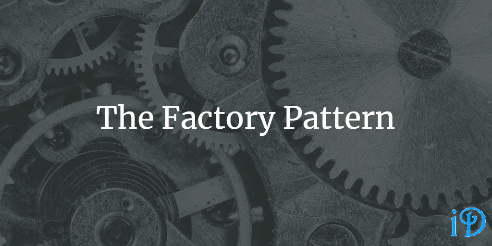

The Factory Pattern is used to encapsulate object creation in order to increase flexibility and adhere to the Open-Closed Principle.

*Head First Design Patterns* by Eric Freeman and Elisabeth Freeman provides an excellent explanation of the Factory Pattern in its fourth chapter.

Pluralsight's [Design Patterns Library](https://app.pluralsight.com/library/courses/patterns-library/table-of-contents) course also has a great module on Factory Patterns from David Starr.

The Factory Pattern is actually a name given to several different patterns: Simple Factory Pattern, Factory Method Pattern, and Abstract Factory Pattern. What they all have in common is that they are all about compartmentalizing the construction of objects in order to increase flexibility as to which concrete implementation of an interface is used. This is important for adherence to the Open-Closed Principle, because the other way to achieve this flexibility tends to involve lengthy switch statements.

Simple Factory Pattern
--

The Simple Factory is so simple it barely counts as a pattern, but it has a lot in commmon with the other factory patterns, so it usually gets listed with them. Essentially, the Simple Factory Pattern puts the logic of which object to create into a factory class, which has a method like `createObject(Type t)`, which can be used to return a concrete instance of that object, based on the input.

Factory Method Pattern
--

In the Factory Method Pattern, object creation is encapsulated in order to allow subclasses to "decide" what concrete object to instantiate. In this pattern, you have an abstract creator class which may define some concrete methods for how to work with the concrete objects (which will all implement the same interface). However, the abstract creator class also defines an abstract `createObject()` method, which its subclasses will implement based on what concrete object they'd like to return. i.e. the abstract class defers instantiation to its subclasses.

The creator class hierarchy will be parallel with the hierarchy of the concrete object hierarchy. At the top of the object hierarchy is an interface or abstract class. Inheriting from that are the concrete objects produced by the creator subclasses.

Now, your code can decide the type of concrete object it would like to create by instantiating a certain creator subclass.

Abstract Factory Pattern
--

While the Factory Method Pattern provides an interface for the creation of an object, the Abstract Factory Pattern provides an interface for creating families of related objects, without specifying their concrete classes.

Though it's much more complicated, the Abstract Factory Pattern is actually pretty similar to the Factory Method Pattern. You have an abstract factory superclass, from which inherit various factories. However, instead of different factories for different objects, you have different factories for different families of objects.

Let's say you want to open a restaurant serving all different types of pasta. Each dish will have different ingredients - your shrimp alfredo will need alfredo sauce and shrimp (of course) as well as some fettuccine, probably. However, your spaghetti and meatballs will require meatballs, some marinara sauce, and spaghetti. All your dishes require a sauce, a topping, and pasta, but these vary between dishes.

You can use the abstract factory pattern to create factories which create ingredients for each dish. Your `ShrimpAlfredoIngredientFactory` would create shrimp, alfredo, and fettuccine, while your `SpaghettiAndMeatballsIngredientFactory` would create meatballs, marinara, and spaghetti.

Unlike the Factory Method Pattern, the hierarchy trees are not really parallel in this case. The factory hierarchy is pretty straightforward, but it's not quite parallel with the ingredients hierarchy. There are several interfaces or abstract classes for ingredients like sauce, topping, and pasta, each of which has one corresponding concrete implementation for each concrete factory. e.g. the abstract `Sauce` class will have an `Alfredo` subclass corresponding to the `ShrimpAlfredoIngredientFactory` and a `Marinara` subclass corresponding to the `SpaghettiAndMeatballsIngredientFactory` (though there could conceivably be some overlap - another dish might also call for alfredo sauce. However, any given dish will require only one sauce).

Implementation of the Abstract Factory Pattern is often achieved using a series of factory methods, one for each of the objects in each family (in our case sauce, topping, and pasta).

Thanks for reading! I hope you find this and other articles here at ilyanaDev helpful! Be sure to follow me on Twitter [@ilyanaDev](https://twitter.com/ilyanaDev).
