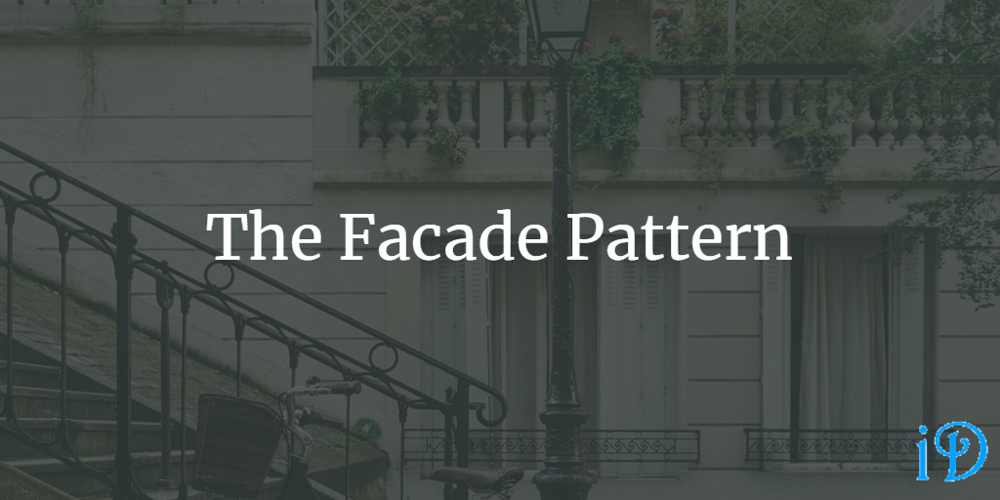

Closely related to the Adapter Pattern, the purpose of the Facade Pattern is to wrap one or more classes in order to simplify the original interface.

*Head First Design Patterns* by Eric Freeman and Elisabeth Freeman gives a pretty good overview of the Facade Pattern in its seventh chapter.

Pluralsight's [Design Patterns Library](https://app.pluralsight.com/library/courses/patterns-library/table-of-contents) course has a module on the Facade Pattern from David Starr.

Note: One of the great things about the Facade Pattern is that many programmers actually use it without even knowing that it has a name; it's just something that very often just makes sense to do. So if you're reading about the Facade Pattern, and it sounds familiar, you're not alone!

Sometimes, there may be many classes all working together to serve a single purpose. For example, you might simulate a kitchen with classes like `Oven` and `Stove` and `Microwave` and `CoffeeMaker` and `Blender` and `CuttingBoard`. And sometimes, you'll want to have access to all the details of each component. But sometimes it might be nice to simplify some processes that require several components.

Let's say we want to make omlettes for breakfast. We don't want to individually call:

```csharp
microwave.Cook(bacon);
cuttingBoard.Cut(bacon);
cuttingBoard.Cut(onions);
cuttingBoard.Cut(mushrooms);
stove.Add(eggs);
stove.Cook();
stove.Add(bacon);
stove.Add(onions);
stove.Add(mushrooms);
stove.Fold(eggs);
coffeeMaker.Brew();
```

Whew! That's a lot of work. What if instead, we just put all those methods in a `KitchenFacade` class:

```csharp
public class KitchenFacade
{
    public Oven oven;
    public Stove stove;
    public Microwave microwave;
    public CoffeeMaker coffeeMaker;
    public Blender blender;
    public CuttingBoard cuttingBoard;

    //constructor

    public void MakeOmletteBreakfast()
    {
        //calls from above
    }

    //other methods
}
```

Now, whenever we want omlettes for breakfast, all we have to type is:

```csharp
KitchenFacade myKitchen = new KitchenFacade();

myKitchen.MakeOmletteBreakfast();
```

Wow, that was easy. That's exactly what the Facade Pattern aims to do, take large, complex interfaces and abstract them so they are simpler and easier to use. And, if we decide we need to make a meal not supported by `KitchenFacade`, we still have access to all the public methods within the underlying kitchen subsystem.

Although commonly thought of as a pattern creating one facade for many classes in a subsystem, the pattern can also be applied to a single, very complicated class.

This pattern is also quite useful when working with legacy code with a poorly designed API, as this poor design can be concealed behind a well-designed facade.

One drawback to the facade pattern is it is not terribly compatible with the Open-Closed Principle. Since we have simplified the API, we have also diminished the granularity of available functions. In the above example, for instance, I would not be able to make an omlette without mushrooms without creating a whole new facade or new method within the existing facade, or typing all the methods out by hand, which was what I was trying to avoid in the first place. To add a `MakeOmletteBreakfastWithoutMushrooms()` method to `KitchenFacade` would violate the Open-Closed Principle.

Thanks for reading! I hope you find this and other articles here at ilyanaDev helpful! Be sure to follow me on Twitter [@ilyanaDev](https://twitter.com/ilyanaDev).
