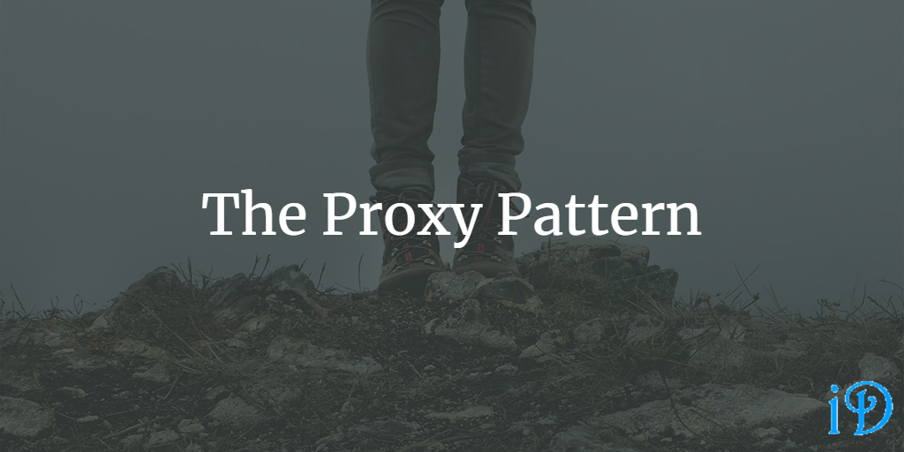

The Proxy Pattern is a common design pattern whose intent is to provide a class that acts as a stand-in for another class in order to control access to it. You may also know it as the Surrogate Pattern.

*Head First Design Patterns* by Eric Freeman and Elisabeth Freeman gives a pretty good overview of the Proxy Pattern in its eleventh chapter.

Pluralsight's [Design Patterns Library](https://app.pluralsight.com/library/courses/patterns-library/table-of-contents) course has a module on the Proxy Pattern from Steve Smith.

At its most basic level, the Proxy Pattern is very simple: it provides a subject interface which is implemented by both the proxy and the concrete subject. In many calls, the proxy stands in for the concrete subject, but it can delegate calls to the real subject when necessary.

Instead of the structure described above, the Proxy Pattern is sometimes implemented via a proxy class which is a subclass of the subject class.

Although there are many, many variations of the Proxy Pattern, some of the most common are the Remote Proxy, the Virtual Proxy, and the Protection Proxy.

Remote Proxy
--

The job of the Remote Proxy is to help the client interact with a subject on a different machine. The Remote Proxy and the client interact with one another locally, and the proxy delegates calls to the subject across the network, usually with the help of a skeleton or service helper on the remote machine. This design allows the client and subject to remain decoupled from the details of communication.

In this variation of the Proxy Pattern, languages often provide frameworks (like WCF in C# and RMI in Java) that auto-generate the proxies to be used, allowing the developer to focus on the subject.

Virtual Proxy
--

The Virtual Proxy often stands in for an object that is expensive or difficult to create. This variation is commonly used to provide a placeholder for an image loading on a screen, so that the rest of the screen can load before the actual image has finished rendering.

Protection Proxy
--

The Protection Proxy ensures that only authorized users can make certain calls to the real subject.

Other Uses
--

Proxy can also be used to optimize an existing system's performance while adhering to the Open-Closed Principle.

Proxy also works pretty well with the Repository Pattern to implement a chached repository.

Proxy is also related to the [Adapter Pattern](https://ilyana.dev/blog/2020-08-21-adapter-pattern/) and [Decorator Pattern](https://ilyana.dev/blog/2020-08-10-decorator-pattern/).

Thanks for reading! I hope you find this and other articles here at ilyanaDev helpful! Be sure to follow me on Twitter [@ilyanaDev](https://twitter.com/ilyanaDev).
