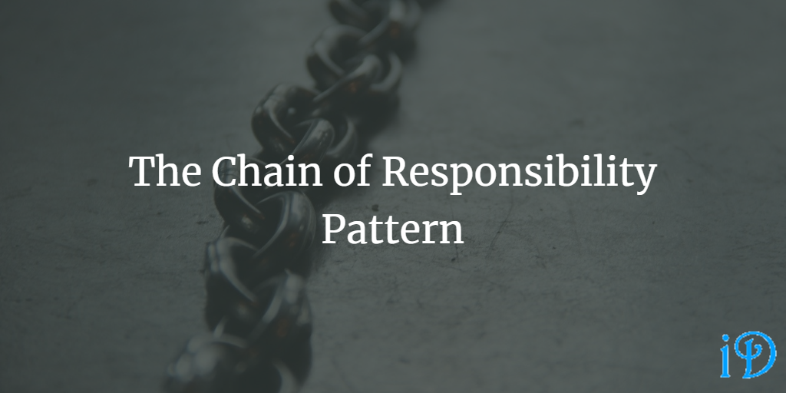

The Chain of Responsibility Pattern decouples the sender of a message from the handler of that message, and it allows multiple objects the chance to handle the message.

*Head First Design Patterns* by Eric Freeman and Elisabeth Freeman provides a quick overview of the Chain of Responsibility Pattern in its appendix.

Pluralsight's [Design Patterns Library](https://app.pluralsight.com/library/courses/patterns-library/table-of-contents) course has a module on the Chain of Responsibility Pattern from Robert Horvick.

The Chain of Responsibility Pattern is essentially a chain of objects that, depending on the type of message, handle the message or pass it on to the next link in the chain. The client knows which link is the first link, and each link knows of its subsequent link. But neither the client nor any of the links knows of more than one other link.

In the traditional implementation of the Chain of Responsibility Pattern, the client depends on a handler interface, from which a variety of concrete handlers inherit. The client and concrete handlers link together to form the chain of responsibility, with the client at the beginning.

One disadvantage to this pattern is, unless a catch-all handler is implemented, messages that do not fit into any of the categories can fall off the end of the chain and not be handled.

Horvick gives a really good example of an implementation that really helped me understand how to use this pattern: categorizing poker hands. In his example program, the hand is passed through a chain of categorizers from royal flush to high card. Since every hand has a high card, the high card categorizer is the end-of-chain handler. Many other categorizations (two pair, three of a kind, full house) satisfy pair, so the pair categorizer comes just before the high card categorizer. However, royal flush is only satisfied by having a royal flush, so the royal flush categorizer comes at the beginning of the chain. TLDR: order your chain correctly!

The Chain of Responsibility Pattern is related to the [Composite Pattern](https://ilyana.dev/blog/2020-08-25-composite-pattern/).

Thanks for reading! I hope you find this and other articles here at ilyanaDev helpful! Be sure to follow me on Twitter [@ilyanaDev](https://twitter.com/ilyanaDev).
