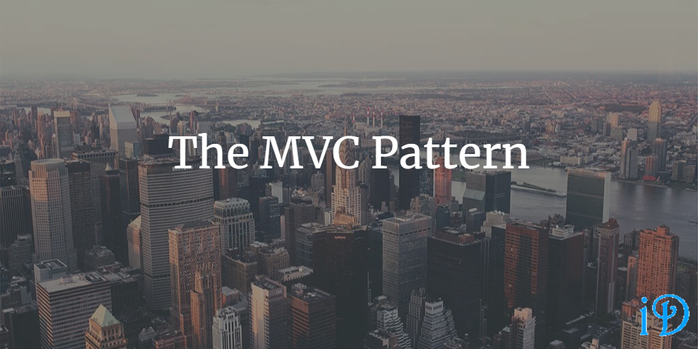

MVC (Model-View-Controller) is a compound pattern commonly used for a variety of applications, particularly web applications. This pattern implements several other design patterns as part of its implementation, which is why it is referred to as a compound pattern.

*Head First Design Patterns* by Eric Freeman and Elisabeth Freeman gives a pretty good overview of the MVC Pattern in its twelfth chapter.

Pluralsight's [Design Patterns Library](https://app.pluralsight.com/library/courses/patterns-library/table-of-contents) course has modules on related patterns: MVP from David Starr, and MVVM from Brian Lagunas.

Pluralsight also has some great courses on applying MVC, like [this step-by-step tutorial](https://app.pluralsight.com/library/courses/building-aspdotnet-core-mvc-web-applications/table-of-contents) from Gill Cleeren.

Microsoft provides a good overview of MVC in .NET [here](https://docs.microsoft.com/en-us/aspnet/mvc/overview/older-versions-1/overview/asp-net-mvc-overview).

MVC is a useful pattern because it provides separation of concerns between different parts of the web application, lending itself well to test-driven development.

Structure
--

As you might expect, the MVC pattern consists of three parts: the Model, the View, and the Controller.

The Model holds data, state, and application logic. It provides the View with the data the View needs to display. The Model changes based on instructions from the Controller.

The View is in charge of displaying the user interface of the application. It can inform the Controller of user input and changes based on instructions from the Controller (as well as in response to changes in the Model).

The Controller responds to user input and instructs the Model and View to change accordingly.

*Head First Design Patterns* gives a good analogy: if the MVC is an Oreo, then the Controller is the cream; its job is to sit between the View and the Model, altering the Model (primarily) based on user input from the View.

Patterns
--

I've been doing some work recently with some applications built with MVC, and while I understood the framework pretty well before, it was helpful to see how the other patterns I've learned about fit in.

The MVC pattern consists of three other patterns put together: the [Strategy Pattern](https://ilyana.dev/blog/2020-08-04-strategy-pattern/), the [Observer Pattern](https://ilyana.dev/blog/2020-08-07-observer-pattern/), and the [Composite Pattern](https://ilyana.dev/blog/2020-08-25-composite-pattern/).

The View and Controller implement the [Strategy Pattern](https://ilyana.dev/blog/2020-08-04-strategy-pattern/); the Controller serves as the View's strategy, so the View delegates handling of user actions to the Controller. For any View, a different Controller can be swapped in to alter the behavior.

The Model and View (and occasionally the Controller) implement the [Observer Pattern](https://ilyana.dev/blog/2020-08-07-observer-pattern/). The Model is the observable, and the View(s) (and Controller(s)) can register as observers. The Model's observers will be notified when the Model changes, allowing these observers to react accordingly.

The View implements the [Composite Pattern](https://ilyana.dev/blog/2020-08-25-composite-pattern/). Since the display consists of many components, each component serves as a composite. Instead of having to ask each individual View component to update, the Controller can just tell the topmost component, and the Composite Pattern takes care of the rest.

Variations
--

**Model-View-Presenter (MVP)**: MVP is similar to MVC in that it is used to help with separation of concerns in an application with a user interface. The Presenter in the MVP is similar to the Controller in the MVC. However, while the View and Model interact with one another in the MVC Pattern, the View and Model are completely decoupled in the MVP Pattern and can interact only via the Presenter (as a result, the Oreo analogy described above is actually more accurate to MVP than MVC). Since the MVP is more decoupled than MVC, separation of concerns is even more clear and TDD capability is increased.

**Model-View-ViewModel (MVVM)**: Like MVC and MVP, MVVM emphasizes separation of concerns and TDD. Unlike those others, however, MVVM is specific to the WPF and Silverlight platforms. The structure of MVVM is essentially the same as MVP, where the View and Model have no knowledge of one another. In the structure, the MVP's Presenter is replaced with MVVM's ViewModel. The ViewModel, according to Lagunas, acts as a facade for the View, simplifying its interface. In this pattern, the View directly binds to properties on the ViewModel.

Resources
--

This post had a lot of links to a number of resources on MVC and related patterns. Here they are all together, as well as a few additional links I found helpful (resources not included above bolded).

* Pluralsight courses:
  * [Design Patterns Library](https://app.pluralsight.com/library/courses/patterns-library/table-of-contents)
  * [MVC web apps tutorial](https://app.pluralsight.com/library/courses/building-aspdotnet-core-mvc-web-applications/table-of-contents)
* [ASP.NET MVC Overview](https://docs.microsoft.com/en-us/aspnet/mvc/overview/older-versions-1/overview/asp-net-mvc-overview) from Microsoft
* My blog posts on related patterns:
  * [Strategy Pattern](https://ilyana.dev/blog/2020-08-04-strategy-pattern/)
  * [Observer Pattern](https://ilyana.dev/blog/2020-08-07-observer-pattern/)
  * [Composite Pattern](https://ilyana.dev/blog/2020-08-25-composite-pattern/)
* **[Comparison of MVC vs MVP](https://www.codeproject.com/Articles/288928/Differences-between-MVC-and-MVP-for-Beginners)**
* **[Wikipedia article on MVVM](https://en.wikipedia.org/wiki/Model%E2%80%93view%E2%80%93viewmodel)**

Thanks for reading! I hope you find this and other articles here at ilyanaDev helpful! Be sure to follow me on Twitter [@ilyanaDev](https://twitter.com/ilyanaDev).
