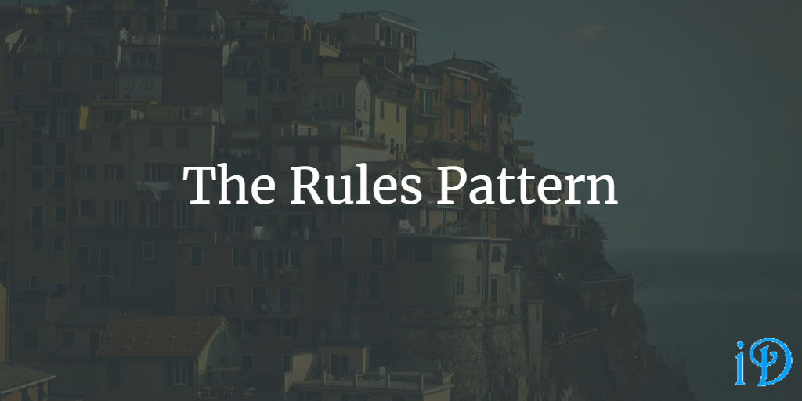

The Rules Pattern, sometimes called the Rules Engine Pattern, is intended to ensure that a class or method which is growing in complexity can have additional logical rules added without interfering with the selection and execution of those rules.

Pluralsight's [Design Patterns Library](https://app.pluralsight.com/library/courses/patterns-library/table-of-contents) course has a module on the Rules Pattern from Steve Smith.

The Rules Pattern is applicable in a class or method with complex business logic whose complexity is likely to continue to increase. A good example is complex discount or gamification logic. The Rules Pattern should be considered in systems with lots of conditional complexity, and where the selection of actions happens in conjunction with the execution of those actions. The Rules Pattern can also be useful in systems involving user-created logic.

The Rules Pattern attempts to "separate individual rules from rules processing logic" and to follow the Open/Closed Principle by allowing for the addition of rules without having to alter the code controlling those rules.

Typically, the Rules Pattern involves an evaluator which accesses a collection of rules and determines from those rules what should be returned or which action(s) should be performed. Each of these rules is defined in its own class, usually implementing some sort of `IRule` interface. This is very similar to the implementation of the [Command Pattern](https://ilyana.dev/blog/2020-08-20-command-pattern/).

The [Greed Game Kata](https://ilyana.dev/blog/2020-10-15-greed-game-kata/) is a useful kata for practicing the Rules Pattern. Keep in mind that TDD (test-driven-development) is another great thing to apply when attempting this kata.

[Here](https://franksbrain.com/2019/08/15/intro-to-test-driven-development-tdd-part-3-using-a-rules-engine-rules-pattern/) is another useful resource relating to the Rules Pattern and the Greed Game Kata.

Thanks for reading! I hope you find this and other articles here at ilyanaDev helpful! Be sure to follow me on Twitter [@ilyanaDev](https://twitter.com/ilyanaDev).
