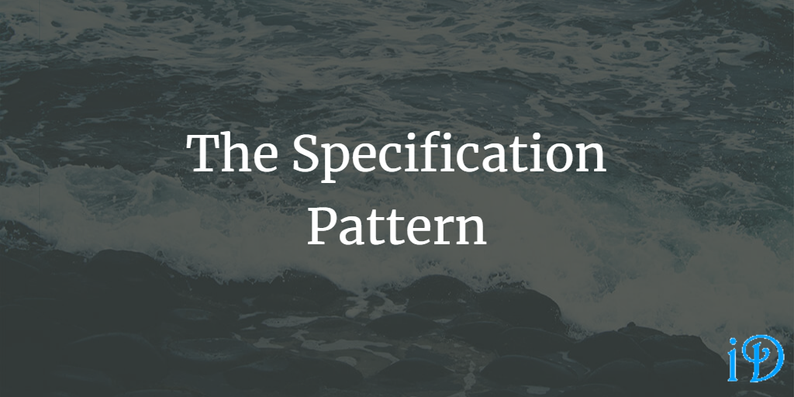

The Specification Pattern uses an object to, well, specify work that needs to be performed. This is separate from the actual performance of that work.

Pluralsight's [Design Patterns Library](https://app.pluralsight.com/library/courses/patterns-library/table-of-contents) course has a module on the Specification Pattern from Steve Smith.

The Specification Pattern is often used in the specification of queries, rules (in the Rules Pattern), and requirements.

The Specification Pattern provides an application with separation of concerns, decoupled classes, and easier testing.

A specification typically has a method `IsSatisfiedBy(Object obj)` which returns true if `obj` satisfies the specification, and false otherwise. Specifications should be value objects; if two specifications have the same criteria, they are identical.

**"A Specification states a constraint on the state of an object."** It is a value object and can test any object of the appropriate type.

Specifications are often used for validation and selection/querying from a repository (often in the [Repository Pattern](https://ilyana.dev/blog/2020-10-12-repository-pattern/)). The Specification Pattern can also be utilized by the [Factory Pattern](https://ilyana.dev/blog/2020-08-14-factory-pattern/) in order to produce an object fulfilling certain requirements.

When using the Specification Pattern for validation, it's useful to use an `ISpecification<T>` interface, which defines a method `IsSatisfiedBy(T object)` which returns a boolean. However, when working with queries, it's better to use predicates instead. You can define an interface, but that interface defines an `Expression<Func<T,bool>>` property instead of an `IsSatisfiedBy` method. Using this predicate property allows the specification to work with SQL.

Predicates are rules (it's better if they're fairly simple ones) that evaluate to a boolean. These can be defined using `Func<T,bool>` or `Expression<Func<T,bool>>` in .NET. It's important to remember that you can use these as variables. e.g. `Func<Animal,bool> isDog = a => a.isDog == true`

The reason you have to use predicates when working with a database is that LINQ to Entities does not support methods like `IsSatisfiedBy`; it has to work with lambdas, like those defined in our `Func<T,bool>`. You can get around this by transplanting your data into an in-memory list and then calling `IsSatisfiedBy` on each member of the list, but you can see where that might be somewhat inefficient.

To work with more complex rules, you can construct Composite Specifications by combining specifications or predicates using `&&` and/or `||` operators.

Thanks for reading! I hope you find this and other articles here at ilyanaDev helpful! Be sure to follow me on Twitter [@ilyanaDev](https://twitter.com/ilyanaDev).
