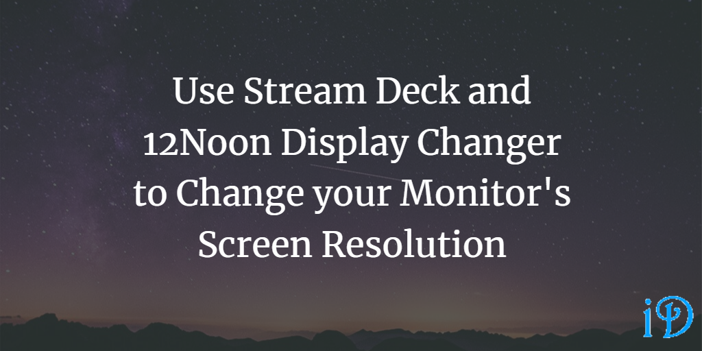
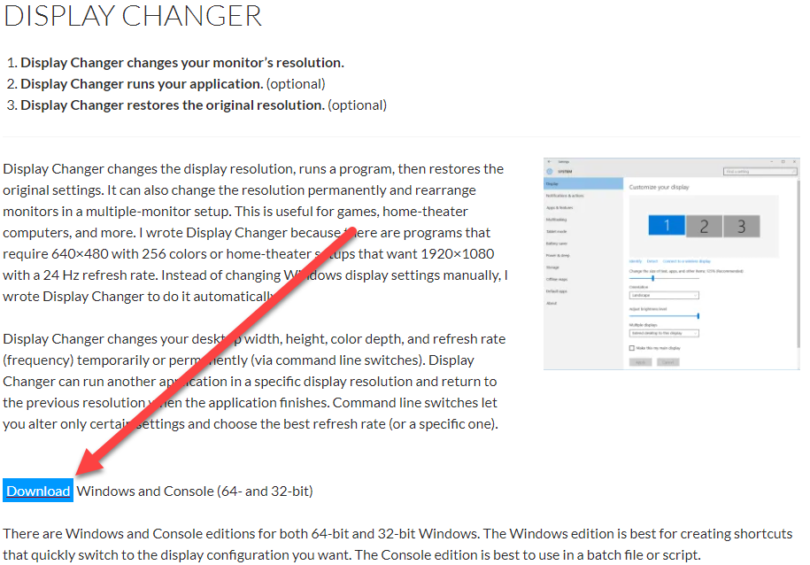
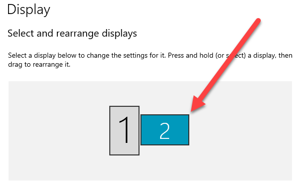
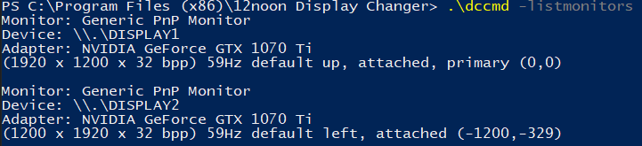
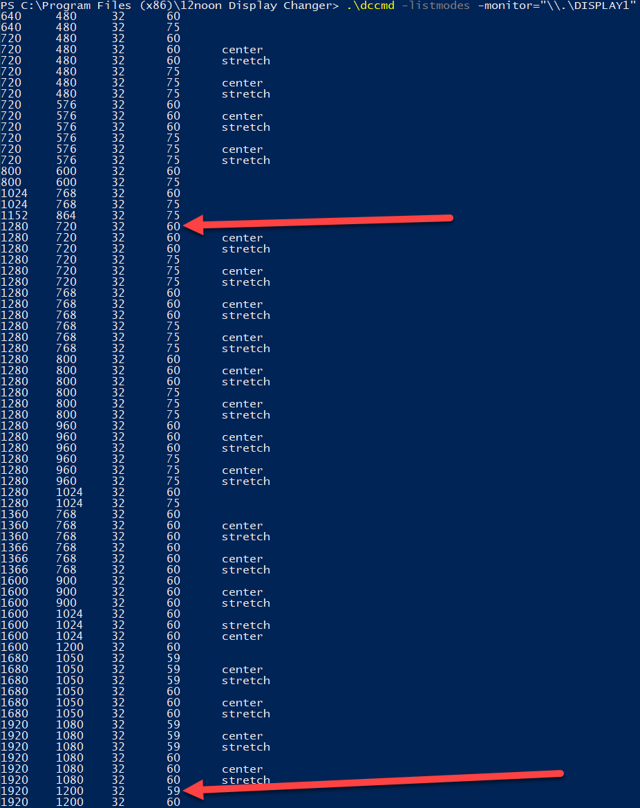
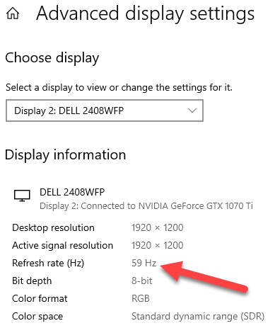
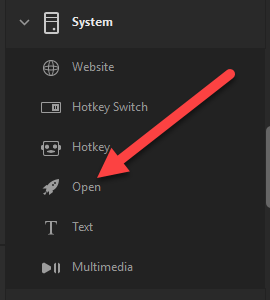
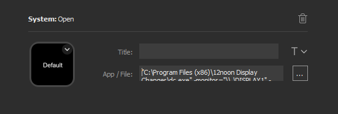

When screen recording content, it is sometimes useful to be able to change your monitor's resolution, and Stream Deck and 12Noon Display Changer offer a way to accomplish this with minimal effort.

I recently read [a blog post from Julie Lerman](https://thedatafarm.com/pluralsight/resize-windows-screen-resolution-with-a-ouch-of-a-stream-deck-button/) on how to do this, and I wanted to share the process that worked for me.

For this article, I'll assume that you already have a Stream Deck set up on your computer.

## Download 12Noon Display Changer

Your first step is to download 12Noon Display Changer, a command line program whih allows you to change your monitor's resolution from the command line. To do this, simply go to [12Noon's website](https://12noon.com/?page_id=80) and click on the **Download** button.



## Move Display Changer to Program Files

The zip file you downloaded (dc.zip) contains several .exe files. We won't need all of them, but it's easiest to just move them all. I extracted all the files from the zip and moved them to a new folder in `Program Files (x86)` named `12noon Display Changer`. Your specific location and file name shouldn't really matter, but you do need to take note of what they are for later steps.

## Determine script to put into Stream Deck

As I'll show you below, you'll need a script to give Stream Deck so it knows what to tell 12noon Display Changer to do. Here are the steps you'll need to follow to determine what script you'll need to provide:

### Identify your Monitor

If your computer setup involves multiple monitors, you'll need to determine the identity of the monitor whose resolution you'd like to change. Note that this will **not** necessarily be the same number shown in the Windows display page of settings. For me, Windows calls the monitor I wanted to use Display 2, but (as you'll see below) the display name I needed to use ended up being `"\\.\DISPLAY1"`.



To identify your monitor, go into Powershell and navigate to the folder where you put your .exe files. For me, that was `C:\Program Files (x86)\12noon Display Changer`. Now run:

```powershell
.\dccmd -listmonitors
```



From here, you should be able to determine which monitor is the one you'd like to use. For me, it was easy to figure this out because I have one portrait-oriented monitor and one landscape-oriented monitor, so even though they have the same resolution it was easy to determine which one I wanted. I'm sorry to say I'm not sure how one would figure this out with two of the exact same monitor with the same orientation. I suspect you'd just have to use a bit of trial-and-error in that case.

### Decide what Resolutions you'd like to switch between

Since my default resolution is 1920x1200, and a common resolution for screen recording is 1280x720, I selected these resolutions.

### Determine the requisite settings for your chosen resolutions

In addition to width and height, a monitor's display settings also include depth (which refers to the supported colors) and frequency (also known as the refresh rate in Hz). It is possible (as was the case for me) that your monitor's supported depth and/or frequency may vary between your chosen resolutions. To ensure that you are selecting settings that your monitor supports, you'll need to run the following (again from your `12noon Display Changer` folder), where `"\\.\DISPLAY1"` is the display name for your chosen monitor.

```powershell
.\dccmd -listmodes -monitor="\\.\DISPLAY1"
```

You'll see a lengthy table of values. They are not listed in Powershell, but the [12noon website](https://12noon.com/?page_id=80) clarifies that the columns are width, height, depth, and frequency, from left to right.

I also had a fifth column, which either contained nothing, "center", or "stretch". This tells the monitor whether to stretch the image to fill the screen, center it on the screen, or perform the default behavior. Since I was unfamiliar with this setting, I stuck with display modes performing the default behavior.



As you can see, I had a lot of options to choose from, which was somewhat overwhelming, but it really wasn't as bad as it looks. All my settings had the same color depth of 32, and I already knew what resolutions I wanted, so I just needed to figure out the frequency.

I went into the Windows display settings to figure this out. I just selected my chosen monitor and clicked Advanced Display Settings at the bottom of the page.

I discovered that my default/current frequency was 59 Hz, which meant my default/current display mode was the second-to-last entry in the table given to me by Powershell.



Next, I took a list at all my frequency options for the 1280x720 resolution. If one of these had been 59 Hz, I would have noted that I did not need to specify frequency in my script. Unfortunately this was not the case. However, 60 Hz was the closest to 59 Hz, so I noted that I'd use that frequency.

### Write out scripts

Finally, you can write out your scripts. If any setting (width, height, depth, frequency) changes between your two resolutions, you'll need to be sure to specify it in **both** scripts.

The basic layout for your script should be:

```powershell
"Path to dc.exe" -monitor="display name for your chosen monitor" -width="your chosen width" -height="your chosen height" -refresh="your chosen frequency"
```

Here was my script for my default resolution:

```powershell
"C:\Program Files (x86)\12noon Display Changer\dc.exe" -monitor="\\.\DISPLAY1" -width=1920 -height=1200 -refresh=59
```

And for my 1280x720 resolution:

```powershell
"C:\Program Files (x86)\12noon Display Changer\dc.exe" -monitor="\\.\DISPLAY1" -width=1280 -height=720 -refresh=60
```

## Set up your Stream Deck Buttons

Finally, the moment you've been waiting for! Go into Stream Deck and select a button and assign it as System/Open.



Paste your first script into the App/File field, and leave the Title field blank. Create a beautiful icon for your button! Or create a functional but very visually disappointing icon like I did.



Repeat this process for your other script. Congratulations! You're now able to change your display settings at the push of a button!

Thanks for reading! I hope you find this and other articles here at ilyanaDev helpful! Be sure to follow me on Twitter [@ilyanaDev](https://twitter.com/ilyanaDev).
