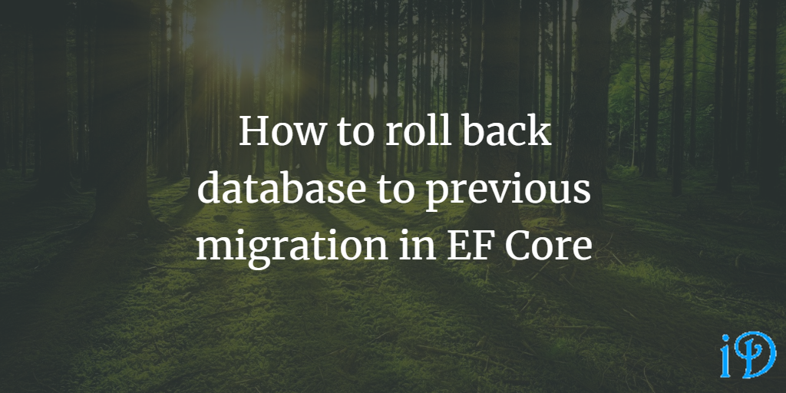

Sometimes it's useful to roll your database back to a previous migration. I found myself having to do just that this morning.

Rolling back the database is very easy, much easier than I'd feared when I originally realized I needed to do this. To help out you and my future self, here's how:

Simply add the full name of the migration you want to roll back to after "update" in your database update script, which (if you're using the command line) will end up looking like this:

`dotnet ef database update MigrationImRollingBackTo`

The project I'm working with had multiple dbcontexts, so I needed to specify the correct one in my script, but the only change I needed to make from my original script was still adding the name of the proper migration.

Thanks to [this StackOverflow thread](https://stackoverflow.com/questions/38192450/how-to-unapply-a-migration-in-asp-net-core-with-ef-core) for this fix.

Thanks for reading! I hope you find this and other articles here at ilyanaDev helpful! Be sure to follow me on Twitter [@ilyanaDev](https://twitter.com/ilyanaDev).
