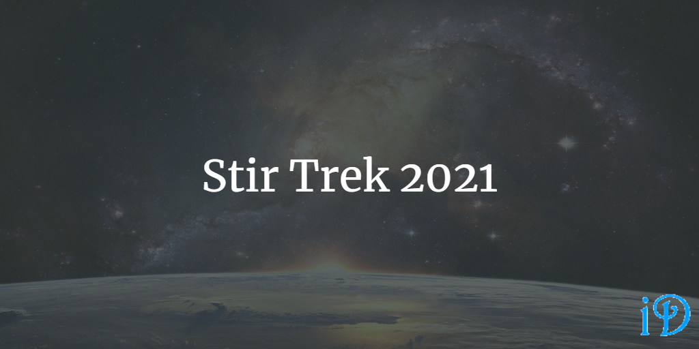

Yesterday, I attended my first Stir Trek, a conference held annually in Columbus, Ohio since 2009.

This year, the event was virtual, so I was able to watch some amazing speakers from the comfort of my home, which was very nice. And, you, too, can watch amazing speakers from the comfort of your home, since the entire event is available on [Stir Trek's YouTube](https://www.youtube.com/watch?v=OsULvjLTyXw).

If that's not your thing, below are my notes on the sessions. They're mostly for my own reference later, but I thought others might find them useful, so I've shared them here. However, if you haven't watched the conference yet, I highly encourage you to do so - my notes do not do these amazing speakers justice!

## What on Earth is Quantum Computing? And will it break all my encryption? - [Craig Stuntz](https://twitter.com/craigstuntz)

"Classical" computing involves using binary operations. It's ubiquitious, so sometimes people forget there are other models of computing. Quantum computers, for instance.

Quantum computers are actually able to efficiently break many common types of encryption like RSA. But larger quantum computers would need to be built to make this truly feasible. Some algorithms like AES are thought to be quantum resistant, but it is possible this is not the case.

Quantum computers generally need to run close to absolute zero and are usually located in data centers because of this. So they're probably not going to take over from general purpose classical computers like your phone.

Qubits are the entangled particles in quantum computers. Increasing qubits leads to an exponential increase in computing power.

Quantum computers work like noise cancelling headphones - they add qubits together to cancel out wrong answers and increase the probability of getting the right answer. Usually it's a good idea to double check quantum computer answers with a classical computer. Indeed, most problems solved with quantum computers generally involve both a classical part and a quantum part.

"Quantum Advantage" - how do we know if a quantum computer is really better than a classical computer? This is a moving target because classical computers keep improving.

Going into this talk I knew nothing about quantum computing. [This article](https://www.technologyreview.com/2019/01/29/66141/what-is-quantum-computing/) helped clear up a few remaining questions I had.

## The Power of No - [Glenn Harmon Jr.](https://twitter.com/GlennHarmonJr)

A "yes" means nothing if it's all you ever say.

A "no" can be an assertive and constructive thing. It doesn't have to be a negative. "Saying no gives you power."

*Never Split the Difference* by Chris Voss talks about how saying "no" gives you power and boundaries.

When should you say no?

- when it keeps you true to your values
- when it protects you from exploitation - what has this person done for me lately?
- when it keeps you focused on your own goals
- to abuse by others (different from exploitation because you're accepting being treated poorly because you don't want to lose that person)
- when you need to change course - "So many of us would rather be right than happy."

If you think you might want to say no, say, "Let me check and get back to you." It gives you time to stop and think and say "no" if that's what's best. But as soon as you've decided, tell the person. Don't procrastinate the "no".

"No" is a short word. So don't give long, rambling explanations. Make it direct and about you. "I need x, and can't do y," not "You need to not do y."

## Burritos at Scale: A SaaS Story - [Matt Eland](https://twitter.com/integerman)

SaaS - Software as a Service

SaaS applications can start to get performance problems fast as the number of concurrent users increases. It's a good idea to use application performance monitoring to keep track of when and where on the application spikes in usage occur. You can then optimize the code relating to that page. Eventually, though, you'll need to scale up to a larger server.

Unfortunately, you're paying for the same server at 3am (probably an off hour) as at 3pm (probably a peak hour). You can scale out to a load balancer instead, which directs requests to several different servers, and some of these go offline when traffic is low. This allows dynamic handling of spikes in traffic.

You'll also eventually need to scale up the database server, but this can be delayed with caching.

Locking is one of the things that makes databases slow. If a row is being updated, it is locked, and no other query can read or write to it. This can be fixed by adding events to a database, rather than objects. Instead of adding a post and then editing it, you would add an "Add" event, and then an "Edit" event. To retrieve the post object, you recreate it from the relevant events. This can really increase performance, but reading a post may not be completely in sync with the written version.

## Introducing Domain-Driven Design - [Steve Smith](https://twitter.com/ardalis)

In Domain-Driven Design, the focus is not data, and it is not infrastructure. It's more focused on what the customer needs, the problem domain, rather than the implementation of the solution.

There are *lots* of books on Domain-Driven Design. *Domain-Driven Design* by Eric Evans defined DDD, but it is very dense and may not serve as the best introduction.

DDD has drawbacks. It's pretty complicated, so it isn't best applied to simple applications, like applications that really only need CRUD and don't have a lot of complex business logic.

Different contexts care about different things. And therefore different entities will be represented differently in different places. And therefore these contexts should be bounded and separated from one another with as little overlap as possible. The necessary overlap should be explicitly contained in a "shared kernel," which should be fairly stable.

Domain Events can be used to pass information between loosely coupled areas of an application. It's an underused but beneficial pattern.

Value Objects can be used to fix the Primitive Obsession code smell. If your Entity has `Street` and `City` and `State` and `Zip Code` primitive properties, why not give it a single `Address` value object instead?

## How The Heck Would I Integrate Serverless Into My Legacy Application? - [Brett Berliner](https://twitter.com/brettberliner)

Serverless is good for applications with lots of components, which need to be used in unpredictable and inconsistent volumes.

A legacy app should be moved to serverless if the application is large, servers are outdated, DevOps is impossible, errors are catastrophic, or business knowledge is limited.

## How to be Right, A Lot - [Sho Fola](https://twitter.com/ShoReason)

Some decisions are reversible, so you can try different things to figure out what you like. These are a "two-way door." e.g. buying something at a store that you can return. Other decisions are not reversible, and you only get one chance at it. These are a "one-way door." e.g. buying a car, buying a house, getting married, quitting your job.

Don't treat a one-way door like a two-way door or vice versa.

Mental models are useful for decisions where speed matters and the consequences of failure are low.

Ask, "How do I know I'm right?" to identify blind spots. Have a willingness to find out that you are wrong.

Beyesian thinking, or probabilistic thinking can be applied to decision making, and it allows you to revise your thinking based on new information. It's not bad to change your mind based on new information.

"Find your muse" - find people who have historically been right and who *have a stake* in being right.

Do a "pre-mortem" - before getting really into a project, identify possible reasons for failure and try to mitigate them.

## Multi-Cloud Magic: Leveraging Multi-Cloud Clusters in Real-World Scenarios - [Adrienne Tacke](https://twitter.com/AdrienneTacke)

A multi-cloud application is any application using two or more cloud providers.

No cloud provider is spared from outages. So how to mitigate this risk?

"Multicloud is a matter of not if but when." The end goal is to be able to gracefully migrate between cloud providers as necessary. A multi-cloud cluster in particular is an elegant way to accomplish this.

## Past Me Was an Idiot - [Jason Dobies](https://twitter.com/jdob)

The software industry is about more than just development.

Writing, speaking, and teaching are very important skills in this industry (and everywhere).

"This is an industry of showing things." Build your brand and your portfolio based on showing what you can do.

It's important to seek out a mentor. Don't be afraid to ask questions of people with more experience than you. But on the other hand, be able to say "I tried x, y, and z" before taking up their time with your question.

Know what's important to you and keep that in perspective.

Just be nice. Work with your team and contribute to a good culture. "Be excellent to each other."

## Snips and Snails and Puppy Dog Tails: Your Software Supply Chain - [Bill Sempf](https://twitter.com/sempf)

*The Cuckoo's Egg* by Clifford Stoll documents the first significant incidence of a foreign entity attacking the internet.

Dependencies can introduce vulnerabilities into your application. Using tools like dependency graphs can help you see if you're making things more complicated than they need to be.

## Building Better Teams Through Play - [Jenny Bramble](https://twitter.com/jennydoesthings)

"Those who have the most to learn play more." e.g. children.

Games allow for an artificial social hierarchy that can be explored in a safe way. And then the lessons learned can be applied to real life.

Play reinforces social bonds.

Inside jokes and team ceremonies reinforce social bonds and help everyone on the team feel connected and invested.

"Wolf Time" (Flow reversed) is a regularly scheduled, semi-structured team bonding time. It can help a team refocus during crunch time.

How do you start playing? Well, don't start off with asking too much of the team. Instead, start small. How you end standup is a good idea for how to start out. Another idea is to do a learning game.

## Enterprise Observability with Open Telemetry - [Christopher Judd](https://twitter.com/javajudd)

Open Telemetry is a tool that can help with consistently identifying failure points in an application. It is open-source and works alongside related commercial tools. It helps generate and collect telemetry data from applications. The telemetry collects metrics and distributed tracing.

Observability measures how well a system's internal states can be identified from its outputs.

Telemetry is the collection of measurements on-site. In software, it gathers data on the use and performance of applications.

## Conclusion

I really enjoyed Stir Trek and learned a ton! It was also a really good experience for me to see just how much there is about software engineering that I had never thought about or never really understood. You don't know what you don't know.

Previously, I'd only associated Stir Trek with my dad getting to see all the Marvel movies before I did; I'm glad now to have had my own experience with it, though I was somewhat disappointed in the lack of Marvel movies. But that is, of course, more Covid's fault than Stir Trek's! Hopefully in the not-too-distant future, I'll get to attend a Stir Trek in person, Marvel movie and all.

And, finally, if you missed it above, the full conference is available [here](https://www.youtube.com/watch?v=OsULvjLTyXw).

Thanks for reading! I hope you find this and other articles here at ilyanaDev helpful! Be sure to follow me on Twitter [@ilyanaDev](https://twitter.com/ilyanaDev).
