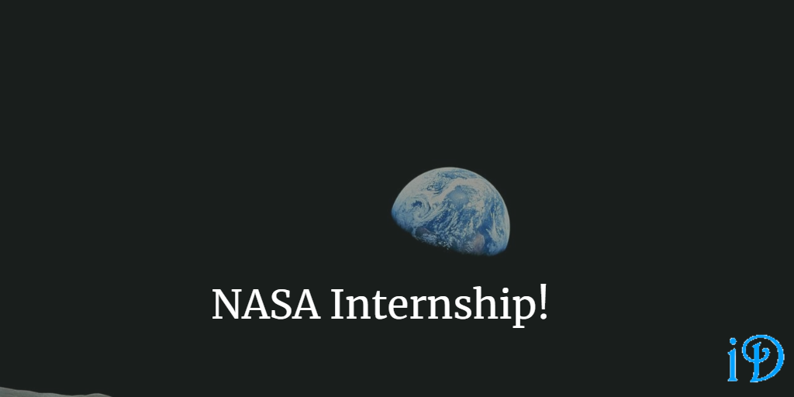

Last week, I began an internship at NASA!

I am super excited to say that I officially work for NASA! At least for this summer. I'll be doing some work to help support the mission of the super awesome [CALIPSO](https://www-calipso.larc.nasa.gov/) satellite! 

I am *beyond* excited about this opportunity to contribute to the amazing work done at NASA, if only for a short time this summer. This has been a dream of mine for almost a decade, so it's really cool to see it coming to fruition - and so far it has been just as incredible as I imagined it would be! I hope that in the future I'll be able to do even more work for NASA!

*The views and opinions expressed in my blog are my own and do not necessarily reflect those of NASA. No official endorsement is intended or implied.* 

Thanks for reading! I hope you find this and other articles here at ilyanaDev helpful! Be sure to follow me on Twitter [@ilyanaDev](https://twitter.com/ilyanaDev).
