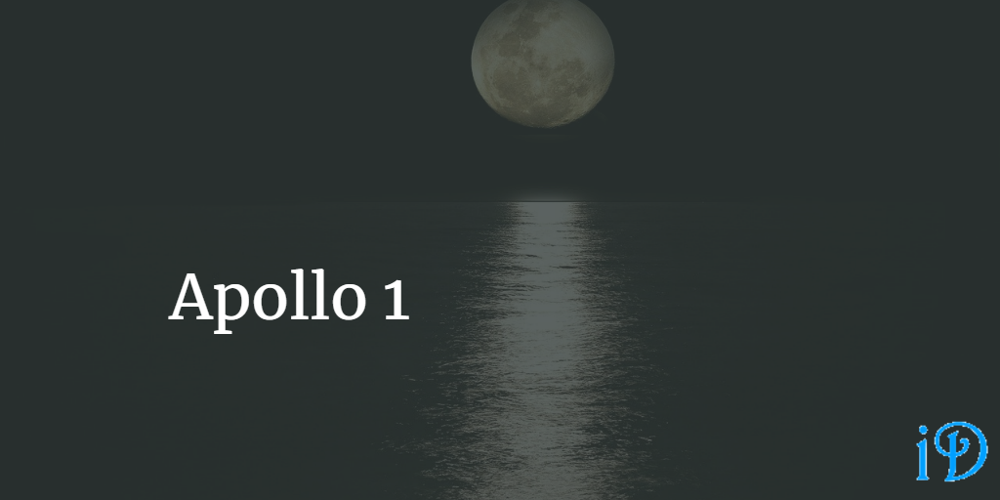
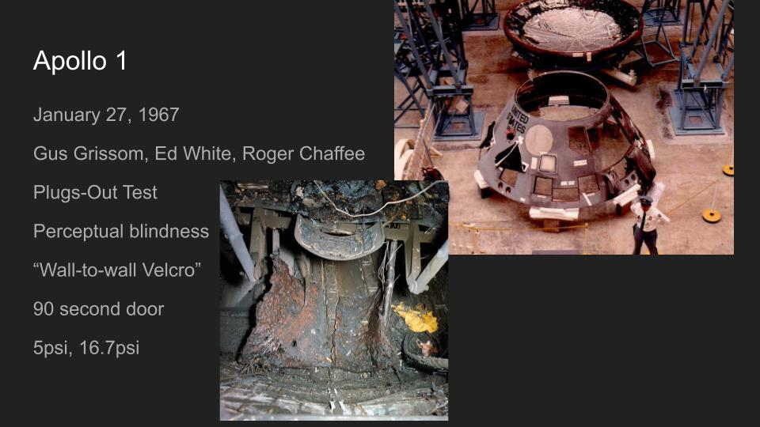

Apollo 1 was America's first tragedy of human spaceflight.

The Apollo 1 disaster, which occurred on January 27, 1967, was nearly the end of the Apollo program to send a man to the moon, but some also argue that it saved the Apollo program because it served as a wake-up call that quality assurance needed to be taken more seriously. In fact, some of the big picture project management lessons that we take away from Apollo 1 can even be applied to software development.

## What was Apollo 1?

*[Images source](https://www.smithsonianmag.com/air-space-magazine/apollo-fire-50-years-180960972/)*

Three men, Gus Grissom, Ed White, and Roger Chaffee, died in the command module of Apollo 1 when a fire started inside the capsule in January of 1967. They were conducting a Plugs-Out Test, essentially a dress rehearsal for the launch that was planned for several weeks later. No one believed the test could be dangerous, because the rocket wasn't fueled, so the proper precautions were not taken to ensure the safety of the astronauts.

### Design Missteps

A number of design missteps occurred, obvious in hindsight, but which the engineers at the time were blind to, due to a concept known as perceptual blindness, in which even very smart people can overlook things right before their eyes.

First, the capsule was pressurized with a pure oxygen atmosphere because the technology at the time wasn't prepared for the complexity of a two-gas oxygen and nitrogen system. The capsule was also pressurized to 5 psi during flight, but during ground testing the procedure was to pressurize to 16.7 psi.

Second, the capsule was *filled* with extremely flammable materials such as Velcro. These materials had been tested for flammability at 5 psi, but no one had tested at the 16.7 psi used in ground testing until after Apollo 1 - they found that these materials burn at least twice as fast in pure oxygen at 16.7 psi as opposed to 5 psi of pure oxygen.

Third, the door design was extremely flawed. Due to concerns about accidental opening, the door took over 90 seconds to open in the best of circumstances. Additionally, the door opened inward - the logic being that an inward-opening door would be pushed out by the difference in pressure between the capsule and the vacuum of space, so the door could not accidentally open while in space. This would have been fine, except that as the fire raised the temperature inside the capsule on that fateful day in January 1967, the interior pressure rose, making it even harder to open the door.

After the Apollo 1 tragedy, the program was delayed to allow for a thorough investigation of the causes of the disaster. Though the root cause of the fire was never found, despite that thorough investigation (the fire was so hot that any evidence of what caused the blaze was melted into oblivion), NASA was able to mitigate the contributing factors - in particular, completely overhauling the door design before the first crewed flight, Apollo 7.

## Project Management Lessons

There are a number of lessons we can learn from Apollo 1 and apply to software development projects and to project management in general.

In the early days of the Apollo program, the pace of development was frantic as NASA and its contractors worked tirelessly to put a man on the moon before the Soviet Union could. However, this pace was unsustainable, and it resulted in errors being made without allowing time to fix them. The tragedy of Apollo 1 reminded everyone that space travel is dangerous, and safety needs to be made the utmost priority.

Apollo 1 reinforces the idea that - particularly when developing systems that are the difference between life and death - sufficient time for testing *must, must, must* be built in to the development cycle in advance and not sacrificed even if the project falls behind schedule.

In fact, everything seems to come back to prioritizing testing, to testing all the edge cases: if someone had tested the flammability of Velcro in 16.7 psi, 100% oxygen *before* Apollo 1, might more consideration have been given to the materials in the capsule or to the atmosphere and pressure during ground testing?

Additionally, it is important to take the time for thorough design reviews of projects and systems, particularly involving people not directly involved with the design itself, so that perceptual blindness can be avoided.

I am not a professional project manager, so I know there are other lessons that we can take away from Apollo 1 that I simply haven't thought of. Let me know what you think of!

## Citations

- [Apollo Capsules](https://historicspacecraft.com/Apollo_Capsules.html)
- [Apollo's Worst Day Smithsonian Magazine Article](https://www.smithsonianmag.com/air-space-magazine/apollo-fire-50-years-180960972/)
- [The Hell of Apollo 1](https://arstechnica.com/science/2017/01/the-hell-of-apollo-1-pure-oxygen-a-single-spark-and-death-in-17-seconds/)

Thanks for reading! I hope you find this and other articles here at ilyanaDev helpful! Be sure to follow me on Twitter [@ilyanaDev](https://twitter.com/ilyanaDev).
