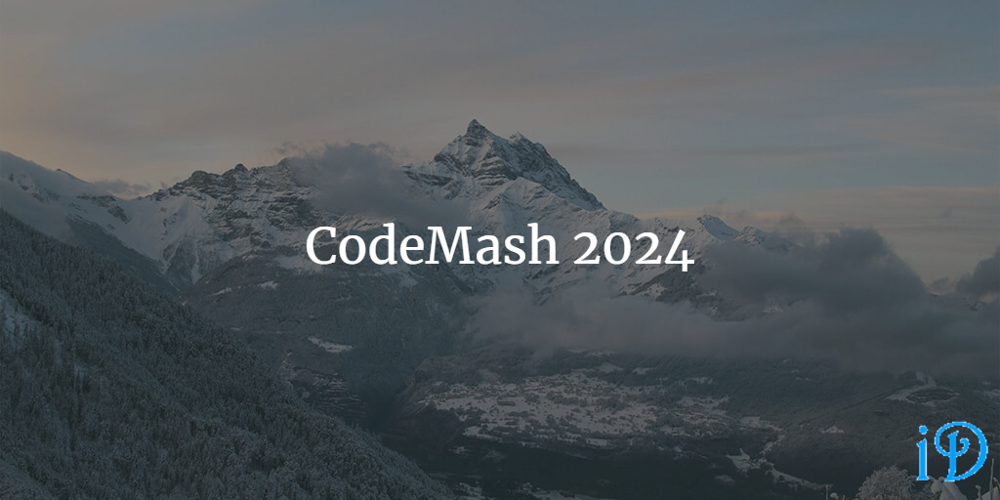

Just over a week ago, I attended CodeMash 2024, and it was a great conference. I learned a lot, and I also had the amazing opportunity to speak at a conference for the second time. 

I gave two talks this year, *Balloon Animals: Blowing Things up at CodeMash* for the kidz at KidzMash, and *Aerospace Engineering for Computer Scientists*. I gave both of these talks last year as well, and I enjoyed updating and improving them for this year. 

I also attended a number of sessions, including 2 precompilers and 3 general sesssions. 

## Aerospace Engineering for Computer Scientists

*Thanks to Matt Eland for the picture!*

I really enjoyed giving this talk again this year. I updated it to include more interesting information (I thought), like a discussion of how being in space impacts human physiology. How did that relate to computer science? Well, it didn't exactly, but just as spacecraft designers have to design spacecrafts to work with humans, programmers have to write code that humans can work with. It was a lot of fun to get to talk about cool space stuff for an hour, and I hope I'll get to give a similar talk again soon. 

## Precompilers

I attended *Building Trust and Breaking Barriers (with LEGO!)* with Thomas Haver and *Event Storming Unleashed: Building Bridges for Effective Communication* with Sarah Dutkiewicz. 

Thomas Haver's LEGO workshop was great! I got to spend a few hours playing with LEGOs, and we had to attempt to build a LEGO robot without the instructions, and with only one member of our team having seen a picture of the final product. It was a lot more challenging than I thought it would be going into it. Our first attempt  was night and day compared with our finished robot, and it was really cool to see the robot come together over several iterations.

Sadukie's Event Storming session was also very interesting and helpful. As someone currently working on a complex project with the University of Michigan's Bioastronautics and Life Support Systems (BLiSS) project team, I definitely see the value of using something like event storming to help all members of a team understand exactly what is being built and how it works. 

## General Sessions

I enjoyed *The User Experience Eclipse: Rise Against Dark Design Patterns* with Scott Showalter; it was a great overview of a lot of "dark design patterns" employed by companies to essentially trick consumers into doing things they don't intend to. Some examples of these design patterns are: bait & switch, train & switch, roach motel, forced continuity, misdiretion, confusing verbiage, and friend spam. It was definitely educational to hear about these tricks explicitly and to know what to avoid.

I also attended *Not Your Mother's or Father's C#* with Brendan Enrick. There were a lot of interesting features and concepts in C# that I hadn't really known much about before the talk (including string interpolation, raw strings, pattern matching, collection expressions, reverse indexing, and range indexing). Definitely very entertaining and interesting!

Finally, I attended *Prime (re)Factoring* with Steve Smith, which was a discussion of how to refactor code to be cleaner by applying the single responsibility principle. I thought it was a good talk, and it was also in keeping with CodeMash's CodeMash Prime theme this year!

Goodbye for now, CodeMash! I hope to be back next year!

